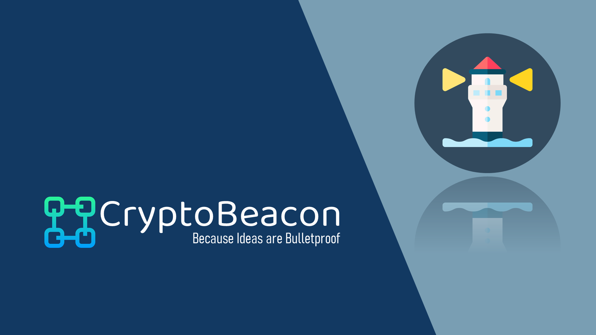

#

Cause decentralized ideas are bulletproof 💡

 

# CryptoBeacon - Annonymous and transparent decentralized platform for inclusive communities

_This PoC is developed as a solution for the MLH Neighborhood Hackathon (14-16 May 2021_)

## PoC Progress for MVP
- [X] Develop a smart contract with basic functionalities 
- [X] Setup Dev environment and test locally
- [X] Deploy on Polygon Mumbai Testnet ( Deployed Contract Here) 
- [X] Working Web3
- [X] Set up initial front-end structure
- [ ] Build working Web3 for Front-end structure 
- [ ] Connect Web3 with Deployed contract 
- [ ] Set up and integrate IPFS
- [ ] Deploy Dapp Frontend on netlify   

## Overview

ElectroCrypt is a voting platform that augments prevalent blockchain powered _e-voting_ systems with the integration of cloud technology, in order to provide strong security, flexible ballot casting, attack mitigation, and public auditing for transparency.

ElectroCrypt's two main objectives are:

- A seamless platform to raise voice against oppression and dominance
- Amplify community rights

## Architecture

<ProjectName> leverages the advantages of [Polygon Network](https://matic.network), which is a blockchain decentralized application platform that provides hybrid _proof-of-stake_ and _plasma-enabled_ sidechains.

The system creates a bridge between decentralized <Network-Name> with <Storage-Component-Name> powered by [Platform Name](#) services.

## Features

## How it works

 

## Key benefits

- A
- B
- C
- D

## Tech stack

- A
- B
- C
- D

## Our team

- A
- B
- C
- D
